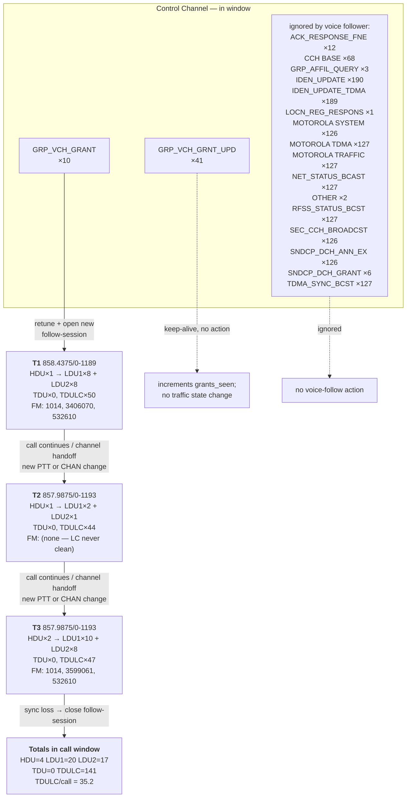

# SDRTrunk call-window timeline — counts + flow

Call window: **22:15:10–22:15:28** (18s)

## Flowchart

## Control-channel message counts (in window)

| Message | Count | Effect on traffic side |
|---|--:|---|
| `IDEN_UPDATE` | 190 | FDMA band definition; decoder uses to resolve CHAN→Hz |
| `IDEN_UPDATE_TDMA` | 189 | TDMA band definition; same role as IDEN_UPDATE |
| `RFSS_STATUS_BCST` | 127 | periodic site status; decoder confirms connection |
| `NET_STATUS_BCAST` | 127 | periodic net status |
| `MOTOROLA TDMA` | 127 | Motorola vendor TDMA state (ignored) |
| `MOTOROLA TRAFFIC` | 127 | Motorola vendor traffic status (ignored) |
| `TDMA_SYNC_BCST` | 127 | microslot sync; used only for TDMA decoding |
| `SEC_CCH_BROADCST` | 126 | backup control-channel list |
| `SNDCP_DCH_ANN_EX` | 126 | data-channel availability advertisement |
| `MOTOROLA SYSTEM` | 126 | Motorola vendor system status (ignored) |
| `CCH BASE` | 68 | callsign ID broadcast (cosmetic) |
| `GRP_VCH_GRNT_UPD` | 41 | grant rebroadcast; no retune, call already active |
| `ACK_RESPONSE_FNE` | 12 | network ack of a prior unit action |
| `GRP_VCH_GRANT` | 10 | retune + open new traffic follow-session |
| `SNDCP_DCH_GRANT` | 6 | data-channel grant; voice follower ignores |
| `GRP_AFFIL_QUERY` | 3 | network queries unit affiliations |
| `OTHER` | 2 | (effect not mapped) |
| `LOCN_REG_RESPONS` | 1 | location-registration response |

Total CC messages in window: **1535**  (of which **10** triggered a voice follow-session)

## Traffic-channel message counts per follow-session

| Session | Freq / CHAN | Span | HDU | LDU1 | LDU2 | TDU | TDULC | LC-FAIL | Sources |
|---|---|--:|--:|--:|--:|--:|--:|--:|---|
| **T1** | 858.4375/0-1189 | 6s | 1 | 8 | 8 | 0 | 50 | 1 | 1014, 3406070, 532610 |
| **T2** | 857.9875/0-1193 | 3s | 1 | 2 | 1 | 0 | 44 | 0 | — |
| **T3** | 857.9875/0-1193 | 6s | 2 | 10 | 8 | 0 | 47 | 1 | 1014, 3599061, 532610 |

## Aggregate totals

- **HDU** (PTT presses observed): **4**
- **LDU1 / LDU2** (voice frame pairs): **20 / 17**
- **TDU** (real terminators): **0**
- **TDULC** (terminator tail): **141**
- **TDULC / HDU ratio**: **35.25** per call

## Key cause-effect rules observed

1. **`GRP_VCH_GRANT`** is the only control-channel message that moves the traffic decoder. Every session in this capture was opened by one.
2. **`GRP_VCH_GRNT_UPD`** is emitted ~every 200 ms while a call is active — it's a keep-alive rebroadcast, not a new grant. Fishball's `grants_seen` counter currently increments on every one; deduplicating by `(TG, CHAN)` within a rolling 1-2 s window would match SDRTrunk's semantic count.
3. Everything else (IDEN_UPDATE, RFSS/NET_STATUS, SEC_CCH, TDMA_SYNC, MOTOROLA vendor, SNDCP_*, GRP_AFFIL_*, ACK_RESPONSE, registration opcodes) is site state / bookkeeping — never causes a voice follow-session.
4. A follow-session ends on **SYNC LOSS**, not on TDU/TDULC. The TDULC tail continues as long as the decoder still holds bit-lock.
5. **LINK CONTROL CRC FAIL** on a LDU1 line means the in-frame LC bits didn't survive FEC; the `FM:` value on that line is unreliable. Fishball has no LC FEC today so it would treat those `FM:` values as real.
